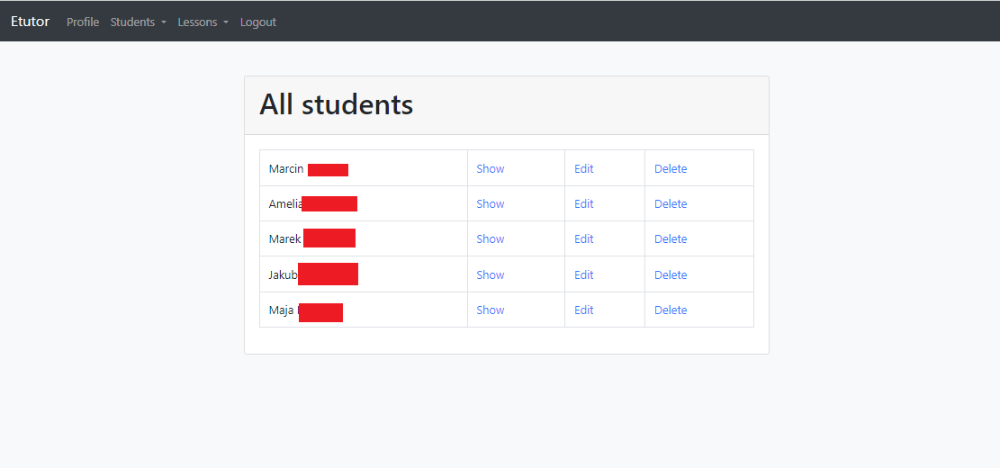

# Tutoring App: ETutor

## Description
This is a tutoring app that allows tutors to add their students to the system, create lessons, send reminder through email. The app has also calendar and tracks payments for the tutor. The interactive whiteboard with proivate lessons room is included. 

## Stack
- Django
- JavaScript
- HTML
- CSS
- Bootstrap
- PostgreSQL
- Redis
- Celery
- Docker
- Docker Compose
- AWS SES
- AWS ECS
- WebSockets

## Features

### Interactive Whiteboard

- Draw with students in real time
- Chat in real time
- Upload images
- Save the whiteboard as an image
- Use calculator programmed into site

### Email Reminder

- Send reminder email to student before lesson
- Send reminder email to tutor before lesson

### Dashboard

- Show incoming lessons
- Show weekly money earned
- Show missing payments for students

### Student's page

#### All students (Typical CRUD)

#### Create student, most important information for online tutoring

### Lessons

#### Calendar, shows all lessons in this and next week

#### Create lesson

- Choose subject
- Choose student
- Choose date and time
- Choose duration
- Choose price
- Choose if lesson is online or in person
- Choose if lesson is one time or recurring
- Choose to send reminder email

# Project is being refactored in private repository to use NoSQL and FastAPI for ease of deployment and scalability
